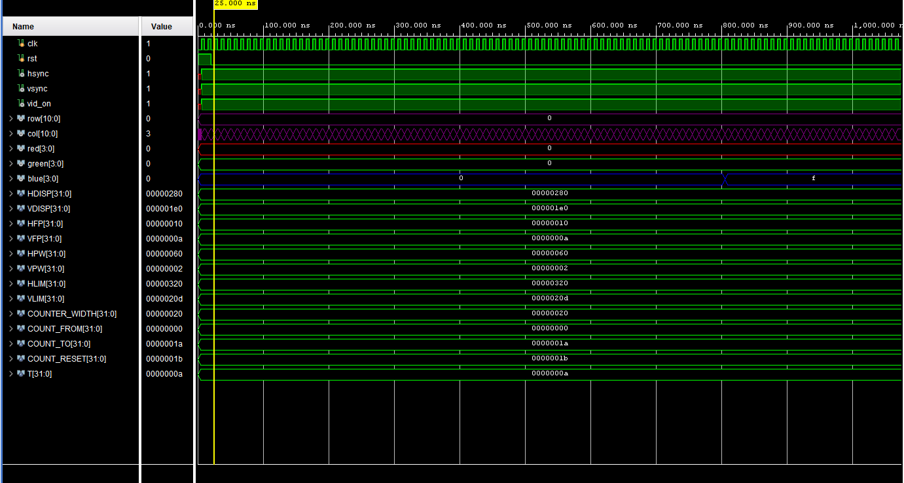

# System on Chip Design & Verification
## **FPGA VGA Driver Project**
David Ajayi - G00419525

Hello there, David Ajayi here. My System on Chip (SOC) project is a Flashing cross design. The Artix-7 Board turns on, once connected to the monitor with a vga and the color changes. . The colors in the background changes to the color of the cross and the reverse too.

## **Template VGA Design**
### **Project Set-Up**

For the project,Vivado was used to created the project. I followed an example design on moodle.The output clock frequency had to be customized to 25MHz, which allowed the VGA signal and syncs timing can match. By following the template code, I was able to display the Color Cycle and the Color Stripes. This allow me to get started on my project.

### **Template Code**
The Verilog code I followed was the color stripe template, when the Artix-7 board is connect to an monitor using a VGA. The pixel resolution is 640x480. It diplays different colors in a column/row. 

clk, rst is the clock and reset that have been set to inputs.
[10:0] rol and col are bit inputs that are used to position the pixels on the vga board.
[3:0] red,green, blue are 4-bit outputs that represent the RBG color to make a multitude of colors.
[3:0] red_reg, green_reg, blue_reg are bit registers that represent current state of the color components. red_next,green_next, blue_next are next state values used in the logic state machine 

As seen for the images we can see in from the first if statement, from the pixels from 0 t0 80 the color showcase is black, col is used to guide the pixels to do the same below to make an column.
the binary code 0000, 0000, 0000 makes black

from col 80 to 160, we can see in from the second if statement, from the pixels from 80 t0 160 the color showcase is blue, col is used to guide the pixels to do the same below to make an column.
the binary code 0000, 0000, 1111 makes blue

from col 160 t0 240, we can see in from the third if statement, from the pixels from 160 t0 240 the color showcase is green, col is used to guide the pixels to do the same below to make an column.
the binary code 0000, 1111, 0000 makes green

from col 240 to 320, we can see in from the fourth if statement, from the pixels from 240 t0 320 the color showcase is cyan, col is used to guide the pixels to do the same below to make an column.
the binary code 0000, 1111, 1111 makes cyan

from col 320 t0 400, we can see in from the fifth if statement, from the pixels from 320 t0 400 the color showcase is red, col is used to guide the pixels to do the same below to make an column.
the binary code 1111, 0000, 0000 makes red

from col 400 t0 480, we can see in from the sixth if statement, from the pixels from 400 t0 480 the color showcase is pink, col is used to guide the pixels to do the same below to make an column.
the binary code 1111, 0000, 1111 makes pink

from col 480 t0 560, we can see in from the seventh if statement, from the pixels from 480 t0 560 the color showcase is yellow, col is used to guide the pixels to do the same below to make an column.
the binary code 1111, 1111, 0000 makes yellow

from col 560 t0 640, we can see in from the eigth if statement, from the pixels from 560 t0 640 the color showcase is white, col is used to guide the pixels to do the same below to make an column.
the binary code 1111, 1111, 1111 makes white

else begin 
red_next <= 4'b1111;
green_next <= 4'b1111;
blue_next <= 4'b1111;
end
everything else that wasn't called in the previous statements gets turned to white

The purpose of always@(posedge clk, posedge rst) to ensure that when the reset signal is triggered then all the RGB outputs get reset to zero.
 

### **Simulation**
Simulation for the color stripe shows the correct operation used for a VGA controller, This simulation dhows of the timing and behavior of various signals. It helps ensure that the logic state machine design behaves as expected under different conditions.

Simulation for the cross design shows the correct operation used for a VGA controller, This simulation dhows of the timing and behavior of various signals. It helps ensure that the logic state machine design behaves as expected under different conditions.

### **Synthesis**

## **My VGA Design Edit**

The white cross is my final design

First I made the french flag but then I decided to change that into a cross instead. As you can see from the image above, I was testing the best place to put horizontal line for my cross(the cyan line)

from the image above I was trying to decide what type of cross I wanted, the length and size was my main concern.
My next objection is to have it flash colors. 

### **Code Adaptation**

I followed the color stripe code then modifed the code in order to make my cross design.
if(col >= 11'd300 && col < 11'd360) begin
red_next <= 4'b1111;
green_next <= 4'b0000;
blue_next <= 4'b0000;
end

col from 300-360 will be white from top to bottom

else if(row >= 11'd220 && row < 11'd280) begin
    red_next <= 4'b1111;
    green_next <= 4'b0000;
    blue_next <= 4'b0000;
end
row from 220-280 will be white from left to right

else begin
    red_next <= 4'b1111;
    green_next <= 4'b1111;
    blue_next <= 4'b1111;
end

everything else not mention above, the pixels turn to black

